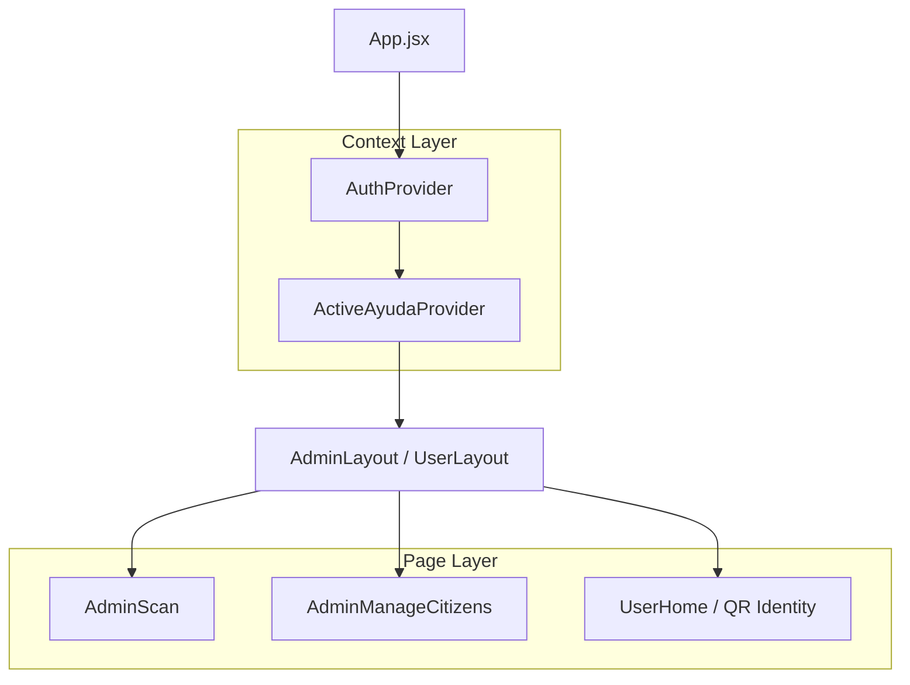

# Salinlahi: Technical Architecture & Security Framework

## 1. Executive Summary
**Salinlahi** is a digital transformation platform designed for Local Government Units (LGUs) to streamline the distribution of social amelioration (Ayuda). The system prioritizes data integrity, operational resilience in low-connectivity environments, and rigorous role-based security. This document details the architectural decisions that ensure "Salinlahi" is defense-ready and technically robust.

---

## 2. System Architecture Overview

### 2.1 Technology Stack
- **Frontend**: React 19 (Vite)
- **Backend**: Firebase / Firestore (NoSQL Document Store)
- **Authentication**: Firebase Auth (Identity Platform)
- **Scanning Engine**: Html5Qrcode (High-performance JS implementation)

### 2.2 Component Tree & Data Flow
The application utilizes a hierarchical component structure managed by React Router and global Context providers to maintain state consistency.



---

## 3. Core Operational Strategies

### 3.1 Offline-First QR Strategy
To address the digital divide and intermittent connectivity in rural areas, Salinlahi implements a "Present-and-Verify" offline strategy:
- **Client-Side Generation**: QR codes are generated on the fly using `react-qr-code`.
- **Identity Export**: Citizens can download their **Salinlahi Offline QR** as a PNG. This allows presentation at distribution points without active mobile data.
- **Short-Code Fallback**: Every identity is mapped to a human-readable **Citizen Code** (e.g., `ABC12F`). This provides a critical manual override for staff when hardware or environmental factors (glare, damaged screens) prevent optical scanning.

### 3.2 Dual-Format Ayuda Schema
The platform supports two distinct distribution modalities via a polymorphic schema:

| Format | Category | Use Case | Lifecycle Logic |
| :--- | :--- | :--- | :--- |
| **ONE_TIME** | Relief Goods | Single-instance pickup (e.g., Food packs, Emergency cash). | Marked as 'Claimed' once. Prevents re-entry. |
| **SERVICE** | Labor/Program | Recurring attendance (e.g., TUPAD, Community Service). | Tracks 'Attendance Days' vs 'Required Days'. Records daily timestamped logs. |

---

## 4. Security Mitigations & Data Integrity

### 4.1 Transactional TOCTOU Prevention
To prevent **Time-of-Check to Time-of-Use (TOCTOU)** vulnerabilities—where a citizen might attempt to claim aid twice simultaneously on different devices—Salinlahi utilizes **Firestore Transactions**.

```javascript
// Implementation snippet from AdminScan.jsx
await runTransaction(db, async (transaction) => {
  const existing = await transaction.get(claimRef);
  if (existing.exists()) {
    throw new Error("Claim already recorded.");
  }
  // Atomically commit the claim
  transaction.set(claimRef, { ...claimData });
});
```
*Logic: The database ensures the check for existence and the write operation are atomic. If another claim is registered between the read and write, the transaction automatically fails and retries.*

### 4.2 UI Data Minimization (Privacy by Design)
Adhering to the Principle of Least Privilege, the scanner interface is designed for **Zero-Knowledge Distribution**:
- The UI **only** exposes the citizen’s Name and Citizen Code upon scanning.
- Sensitive PII (Address, Birthday, Contact Numbers) is filtered out of the scanning confirmation modal to prevent unauthorized data exposure to staff or bystanders.

### 4.3 Triple-Gate Verification
Every distribution event follows a strict three-layer verification protocol:
1. **Digital Gate**: QR / Citizen Code lookup in the database.
2. **Physical Gate**: Mandatory checkbox requiring staff to verify a physical ID card against the name on the screen.
3. **Audit Gate**: Manual entries require a "Reason for Manual Entry" log (e.g., Sunlight Glare, Damaged QR) to identify potential fraud patterns.

---

## 5. Role-Based Access Control (RBAC)

The system enforces a strict permission hierarchy managed via `AuthContext`:

| Role | Permissions |
| :--- | :--- |
| **Admin** | Full system control: Manage staff, delete records, create/approve Ayuda events, audit all logs. |
| **Staff** | Operational access: Scan citizens, verify physical IDs, register applicants, record attendance. |
| **Citizen** | Personal access: View identity QR, track personal claim history, apply for ongoing programs. |

---

## 6. Conclusion
The architecture of **Salinlahi** reflects a balance between technical sophistication and real-world usability. By combining atomic Firestore transactions with a resilient offline QR strategy, the system provides a secure, efficient, and fraud-resistant solution for modern government aid distribution.
